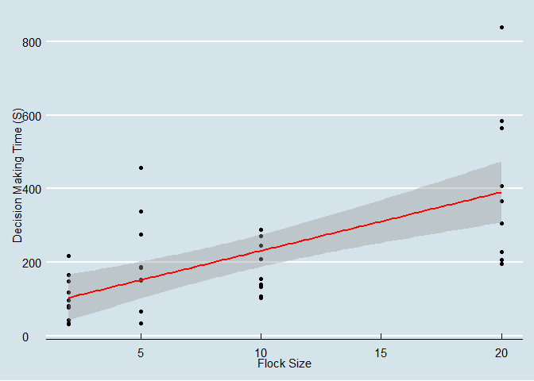
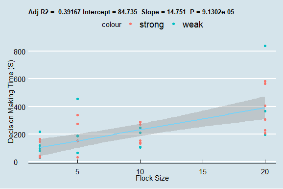

Class 1
================
Johan Horsmans
10/9/2021

# Decision Making Class 1:

### For more information see `readme.md` in the repository.

Loading
    packages:

``` r
library(ggplot2) #For plotting.
```

    ## Warning: replacing previous import 'vctrs::data_frame' by 'tibble::data_frame'
    ## when loading 'dplyr'

``` r
library(ggthemes) #For pretty plots.
library(tidyverse) #For data manipulation.
```

    ## -- Attaching packages --------------------------------------- tidyverse 1.3.0 --

    ## v tibble  3.0.4     v dplyr   1.0.0
    ## v tidyr   1.1.2     v stringr 1.4.0
    ## v readr   1.3.1     v forcats 0.5.1
    ## v purrr   0.3.4

    ## -- Conflicts ------------------------------------------ tidyverse_conflicts() --
    ## x dplyr::filter() masks stats::filter()
    ## x dplyr::lag()    masks stats::lag()

Loading data:

``` r
# Load data:
data<-read.delim("Data.txt")

# Transform "site" to a factor variable:
data$Site<-as.factor(data$Site)

# Create the aggregated deviation metric:
data = data %>%
    mutate(deviation = ifelse(abs(data$Homing.direction..degrees.) > 20, "strong", "weak"))

# Transform the deviation metric to a factor:
data$deviation<-as.factor(data$deviation)
```

Fit linear model:

``` r
set.seed(12)

fit <- lm(data$Decision.making.time..sec. ~ data$Flock.size, data=data)
summary(fit)
```

    ## 
    ## Call:
    ## lm(formula = data$Decision.making.time..sec. ~ data$Flock.size, 
    ##     data = data)
    ## 
    ## Residuals:
    ##     Min      1Q  Median      3Q     Max 
    ## -195.42  -85.31  -21.97   42.19  447.03 
    ## 
    ## Coefficients:
    ##                 Estimate Std. Error t value Pr(>|t|)    
    ## (Intercept)       71.942     35.708   2.015   0.0512 .  
    ## data$Flock.size   15.947      3.189   5.001 1.41e-05 ***
    ## ---
    ## Signif. codes:  0 '***' 0.001 '**' 0.01 '*' 0.05 '.' 0.1 ' ' 1
    ## 
    ## Residual standard error: 133.4 on 37 degrees of freedom
    ## Multiple R-squared:  0.4033, Adjusted R-squared:  0.3872 
    ## F-statistic: 25.01 on 1 and 37 DF,  p-value: 1.407e-05

Make plots:

``` r
ggplot(data,aes(data$Flock.size, data$Decision.making.time..sec.)) +
  geom_point() + 
  geom_smooth(method='lm', formula= y~x, colour = "red") + theme_economist() + xlab("Flock Size") + ylab("Decision Making Time (S)")
```

    ## Warning: Use of `data$Flock.size` is discouraged. Use `Flock.size` instead.

    ## Warning: Use of `data$Decision.making.time..sec.` is discouraged. Use
    ## `Decision.making.time..sec.` instead.

    ## Warning: Use of `data$Flock.size` is discouraged. Use `Flock.size` instead.

    ## Warning: Use of `data$Decision.making.time..sec.` is discouraged. Use
    ## `Decision.making.time..sec.` instead.

<!-- -->

Define function for makking prettier plot:

``` r
ggplotRegression <- function (fit) {

require(ggplot2)

ggplot(fit$model, aes_string(x = names(fit$model)[2], y = names(fit$model)[1],colour=data$deviation)) + 
  geom_point() +
  stat_smooth(method = "lm", col = "#7ad2f6") +
  labs(title = paste("Adj R2 = ",signif(summary(fit)$adj.r.squared, 5),
                     "Intercept =",signif(fit$coef[[1]],5 ),
                     " Slope =",signif(fit$coef[[2]], 5),
                     " P =",signif(summary(fit)$coef[2,4], 5)))
}
```

Create the improved
plot:

``` r
ggplotRegression(fit) + theme_economist() + xlab("Flock Size") + ylab("Decision Making Time (S)") + theme(plot.title = element_text(size=10)) 
```

    ## `geom_smooth()` using formula 'y ~ x'

<!-- -->

Create a new and improved model, seeing if initial deviation explains
any
variance:

``` r
fit2 <- lm(data$Decision.making.time..sec.~data$Flock.size + data$Homing.direction..degrees.^2)

summary(fit2)
```

    ## 
    ## Call:
    ## lm(formula = data$Decision.making.time..sec. ~ data$Flock.size + 
    ##     data$Homing.direction..degrees.^2)
    ## 
    ## Residuals:
    ##     Min      1Q  Median      3Q     Max 
    ## -192.80  -86.41  -19.75   36.20  461.39 
    ## 
    ## Coefficients:
    ##                                 Estimate Std. Error t value Pr(>|t|)    
    ## (Intercept)                      84.7347    37.3391   2.269   0.0293 *  
    ## data$Flock.size                  14.7507     3.3494   4.404 9.13e-05 ***
    ## data$Homing.direction..degrees.  -0.4737     0.4197  -1.129   0.2665    
    ## ---
    ## Signif. codes:  0 '***' 0.001 '**' 0.01 '*' 0.05 '.' 0.1 ' ' 1
    ## 
    ## Residual standard error: 132.9 on 36 degrees of freedom
    ## Multiple R-squared:  0.4237, Adjusted R-squared:  0.3917 
    ## F-statistic: 13.23 on 2 and 36 DF,  p-value: 4.919e-05
