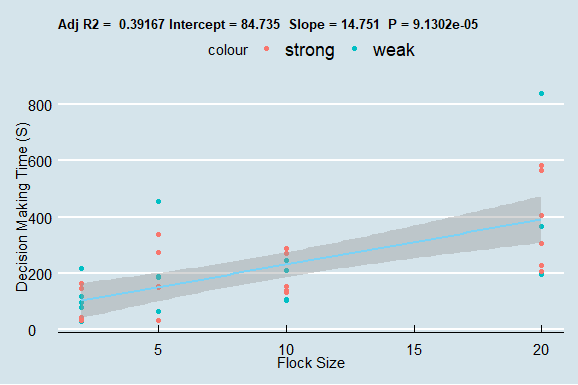

# Decision Making Class 1:

Try to think of a supplementary/complementary analysis or tweak that you could do - if it’s minor and easily implementable, do it, otherwise, try to describe it in one-two paragraphs:

The authors provided deviation from home direction (in degrees) in the data, and we grouped these into strong and weak deviation from home direction with a threshold of 20 degrees. Hence, pigeons with a deviation of more than 20 degrees from the home direction were categorised as “strong deviation” while pigeons with a deviation of less than 20 degrees of home direction were categorised as “weak deviation”. We then modelled the relationship between the decision making time (response time) as a function of flock size and the deviation from the home direction. We found positive correlation between response time and flock size (estimate: 14.7507, std. error: 3.3494, p-value: 0 < 0.5). However, we did not find deviation to be a significant predictor (estimate: -0.4737, std. error: 0.4197, p-value: 0 > 0.5). We also found that the intercept for our model was 84.7347 (std. deviation: 37.3391), indicating that the baseline decision making time of pigeons in the given task is ~ 85 seconds.

A difficult element of reproducing the study was matching the authors' interpretation of an 'exponential' increase in decision making time as flock size increased, as the data seemed to better fit a linear increase. This was a good example for us to see the need to be critical and challenge our own interpretations of the data. Therefore, we decided to carry out the analysis with a linear regression model.

This is our improved plot:
<!-- -->
